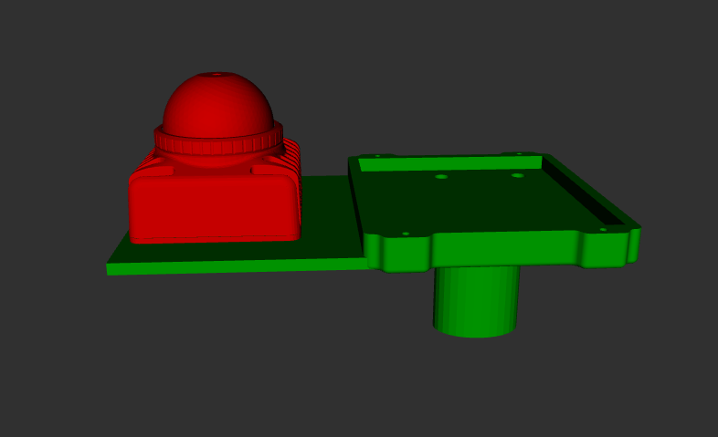
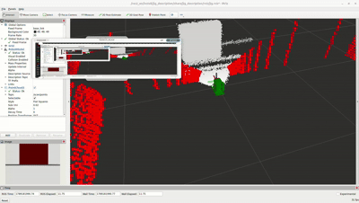
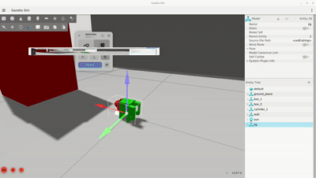
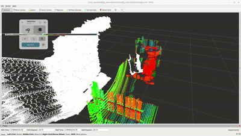

# Simple Mapping Rig

ROS 2 Jazzy Docker-based sensor jig with Livox MID360 LiDAR, built-in IMU, and RealSense D435 RGB-D camera — simulated in Gazebo Harmonic and tested with real hardware.

## Objective

Instrumentation and mapping using LiDAR is a growing field with highly sophisticated commercial solutions:
- [3D Scantech](https://www.3d-scantech.com/product_category/color-3d-scanner/)
- [RIEGL](https://www.unmannedsystemstechnology.com/company/riegl/)

The goal of this project is to explore whether a **budget-friendly scanner jig** can be built and used across different applications — from construction site mapping to industrial inspection.

## Hardware

| Component | Model |
|-----------|-------|
| Compute | Jetson Orin AGX |
| LiDAR | Livox MID360 (with built-in IMU) |
| RGB-D Camera | Intel RealSense D435 |
| OS (Orin) | Ubuntu 22.04 + ROS 2 Humble |
| OS (PC) | Ubuntu 24.04 + ROS 2 Jazzy + Gazebo Harmonic |

## Jig Model


## Demo in Simulation 




## Demo using real Hardware



## Architecture

```
Jetson Orin (real hardware)          Host PC (Ubuntu 24.04)
─────────────────────────────        ──────────────────────
Livox MID360 LiDAR + IMU             ROS 2 Jazzy Docker
RealSense D435 (USB3)       ──────── RViz2 visualization
ROS 2 Humble                         Gazebo Harmonic simulation
ROS_DOMAIN_ID=55                     ROS_DOMAIN_ID=55
```

## Sensor Topics

| Sensor | Topic | Type |
|--------|-------|------|
| LiDAR point cloud | `/livox/lidar` | `sensor_msgs/PointCloud2` |
| LiDAR IMU | `/livox/imu` | `sensor_msgs/Imu` |
| RGB image | `/camera/camera/color/image_raw` | `sensor_msgs/Image` |
| Depth image | `/camera/camera/depth/image_rect_raw` | `sensor_msgs/Image` |
| Depth aligned | `/camera/camera/aligned_depth_to_color/image_raw` | `sensor_msgs/Image` |
| Depth point cloud | `/camera/camera/depth/color/points` | `sensor_msgs/PointCloud2` |

## Quick Start

### Simulation (PC)

```bash
git clone https://github.com/NizarMhatli/simple-mapping-jig.git
cd simple-mapping-jig
mkdir -p build install log maps config
touch config/.bash_history
make build
make up
make shell
```

Inside container:
```bash
colcon build --symlink-install
source install/setup.bash
ros2 launch jig_description display.launch.py
```

### Real Hardware (Jetson Orin)

```bash
cd ~/ros2_ws
source install/setup.bash
ros2 launch livox_ros_driver2 jig_sensors_launch.py
```

This launches both the Livox MID360 and RealSense D435 simultaneously.

### Visualize from PC

```bash
# Set domain ID to match Orin
export ROS_DOMAIN_ID=55

# Topics appear automatically via FastDDS discovery
ros2 topic list | grep -E "livox|camera"

# Launch RViz
rviz2
```

## Package Structure

```
workspace/
└── jig_description/
    ├── urdf/
    │   ├── Main_jig.urdf.xacro           # Top-level xacro
    │   ├── base.urdf.xacro               # Jetson Orin Nano base
    │   ├── lidar.urdf.xacro              # Livox MID360 + built-in IMU
    │   ├── realsense.urdf.xacro          # RealSense D435 mount + frames
    │   ├── imu.urdf.xacro                # Reserved (IMU merged into LiDAR)
    │   └── gazebo_components.urdf.xacro  # Gazebo sensors + plugins
    ├── meshes/
    │   ├── jig_base.stl                  # Base link mesh
    │   ├── mid360.stl                    # Livox MID360 mesh
    │   └── (realsense uses d435.dae from realsense2_description)
    ├── launch/
    │   ├── display.launch.py             # RViz + robot_state_publisher
    │   └── gazebo.launch.py              # Gazebo Harmonic simulation
    ├── config/
    │   └── gz_bridge.yaml               # Gazebo↔ROS 2 topic bridges
    ├── worlds/
    │   └── jig_world.sdf                # Gazebo world with obstacles
    └── rviz/
        └── jig.rviz                     # RViz config
```

## Docker Setup

The simulation runs inside a Docker container with full NVIDIA GPU passthrough for Gazebo Harmonic sensor rendering (GPU LiDAR, depth camera, RGB camera).

```bash
make up      # Start container
make shell   # Enter container
make down    # Stop container
make rebuild # Rebuild Docker image
```

Key requirements for GPU sensor rendering in Docker:
- `nvidia-container-toolkit` installed and configured on host
- `runtime: nvidia` in docker-compose.yaml
- NVIDIA EGL vendor libraries mounted: `/usr/share/glvnd/egl_vendor.d`
- `EGL_PLATFORM=device` set in environment

## Simulation Sensors

All sensors simulated in Gazebo Harmonic via `libgz-sim-sensors-system.so`:

| Sensor | Type | Rate | Topic |
|--------|------|------|-------|
| Livox MID360 | `gpu_lidar` | 10 Hz | `/scan/points` |
| Built-in IMU | `imu` | 200 Hz | `/imu/data_raw` |
| RealSense RGB | `camera` | 30 Hz | `/camera/color/image_raw` |
| RealSense Depth | `depth_camera` | 30 Hz | `/camera/depth/image_rect_raw` |

## TODO
- [ ] Create `real_sensors.launch.py` — jig URDF with real hardware TF frames
- [ ] Add SLAM integration (FAST-LIO or slam-toolbox)
- [ ] Add GUI for scan data recording and management
- [ ] Replace placeholder STL meshes with real CAD files
- [ ] Test full mapping pipeline on real hardware
